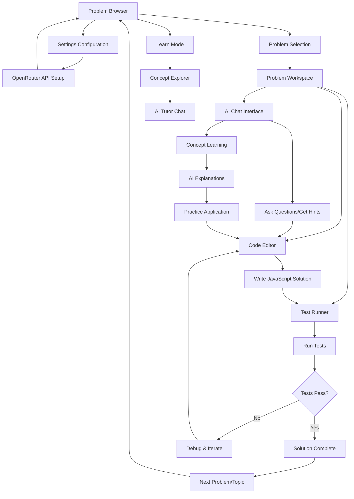

# DSA AI Tutor - UI/UX Implementation Plan

## 1. User Flow Diagram



## 2. Information Architecture (IA)

```
DSA AI Tutor (Entry: Problem Browser)
├── Problem Browser (Main Entry Point)
│   ├── Topic Categories
│   │   ├── Arrays
│   │   ├── Strings
│   │   ├── Hash Maps
│   │   ├── Recursion
│   │   └── Basic Algorithms
│   ├── Problem Lists by Topic
│   └── Navigation to Other Sections
├── Settings
│   ├── API Configuration
│   ├── Model Selection  
│   └── User Preferences
├── Problem Workspace
│   ├── Problem Description
│   ├── Code Editor
│   ├── AI Chat Panel
│   ├── Test Runner
│   └── Progress Indicator
└── Learn Mode
    ├── Concept Explorer
    ├── AI Tutor Chat
    └── Examples Library
```

## 3. Screen Wireframes (Text-Based)

### 3.1 Problem Browser Screen (Entry Point)
```
┌─────────────────────────────────────────────────┐
│ HEADER                                          │
│ [DSA AI Tutor]    [Learn Mode] [Settings ⚙️]   │
├─────────────────────────────────────────────────┤
│ WELCOME MESSAGE                                 │
│ Welcome back! Ready to practice DSA?            │
│ Last worked on: Two Sum (Arrays)                │
│                                                 │
├─────────────────────────────────────────────────┤
│ TOPIC NAVIGATION                                │
│ ┌─────┐ ┌─────┐ ┌─────┐ ┌─────┐ ┌─────┐       │
│ │Arrays│Strings│Hash │Recur│Algos│             │
│ │ (15) │ (12)  │Maps │sion │ (8) │             │
│ │  ●   │       │ (10)│ (6) │     │             │
│ └─────┘ └─────┘ └─────┘ └─────┘ └─────┘       │
│                                                 │
├─────────────────────────────────────────────────┤
│ PROBLEM LIST (Arrays Selected)                  │
│                                                 │
│ ┌─────────────────────────────────────────────┐ │
│ │ ✓ Two Sum                        Easy  🟢   │ │
│ │   Find two numbers that add to target       │ │
│ │   Last attempt: 2 days ago                  │ │
│ └─────────────────────────────────────────────┘ │
│                                                 │
│ ┌─────────────────────────────────────────────┐ │
│ │ → Merge Intervals              Medium 🟡     │ │
│ │   Combine overlapping intervals             │ │
│ │   [Continue] [Start Fresh]                  │ │
│ └─────────────────────────────────────────────┘ │
│                                                 │
│ ┌─────────────────────────────────────────────┐ │
│ │   Maximum Subarray               Hard  🔴   │ │
│ │   Find contiguous subarray with max sum     │ │
│ │   [Start Problem]                           │ │
│ └─────────────────────────────────────────────┘ │
│                                                 │
├─────────────────────────────────────────────────┤
│ QUICK ACCESS                                    │
│ [🧠 Learn Concepts] [⚡ Random Challenge]       │
│                                                 │
├─────────────────────────────────────────────────┤
│ PROGRESS BAR                                    │
│ Arrays Progress: ████████░░░░ 2/15 Complete     │
│ Overall Progress: ██████░░░░░░ 12/50 Problems   │
└─────────────────────────────────────────────────┘
```

### 3.2 Settings Configuration Screen
```
┌─────────────────────────────────────────────────┐
│ HEADER                                          │
│ [← Back to Problems]  Settings                  │
├─────────────────────────────────────────────────┤
│ CONFIGURATION PANEL                             │
│                                                 │
│ OpenRouter API Configuration                    │
│ ┌─────────────────────────────────────────────┐ │
│ │ API Key: [●●●●●●●●●●●●●●●●●●●●●●●●●●●●]     │ │
│ └─────────────────────────────────────────────┘ │
│                                                 │
│ Model Selection                                 │
│ ┌─────────────────────────────────────────────┐ │
│ │ Model: [anthropic/claude-3-haiku ▼]        │ │
│ └─────────────────────────────────────────────┘ │
│                                                 │
│ Learning Preferences                            │
│ ☑ Show detailed explanations                   │
│ ☑ Progressive hints                             │
│ ☐ Auto-run tests                               │
│ ☑ Remember problem progress                     │
│                                                 │
│ Theme                                           │
│ ○ Light  ● Dark  ○ Auto                        │
│                                                 │
│ [Test Connection] [Save Settings]               │
│                                                 │
├─────────────────────────────────────────────────┤
│ STATUS                                          │
│ ✓ API Connected • Model: Claude Haiku          │
│ 💾 Settings saved locally                       │
└─────────────────────────────────────────────────┘
```

### 3.3 Problem Workspace Screen (Main Interface)
```
┌─────────────────────────────────────────────────────────────┐
│ HEADER                                                      │
│ [← Back to Problems] Two Sum (Easy)      [Settings][Help]   │
├─────────────────────────────────────────────────────────────┤
│ MAIN CONTENT AREA                                           │
│                                                             │
│ ┌─────────────────────┐ ┌─────────────────────────────────┐ │
│ │ PROBLEM DESCRIPTION │ │ AI TUTOR CHAT                   │ │
│ │                     │ │                                 │ │
│ │ ## Two Sum          │ │ 💬 Hi! I'm here to help you     │ │
│ │                     │ │    solve this problem.          │ │
│ │ Given an array...   │ │                                 │ │
│ │                     │ │ You: How do I approach this?    │ │
│ │ **Examples:**       │ │                                 │ │
│ │ Input: [2,7,11,15]  │ │ 🤖 Great question! Let's think  │ │
│ │ Target: 9           │ │    about this step by step...   │ │
│ │ Output: [0,1]       │ │                                 │ │
│ │                     │ │ [Type your question...]         │ │
│ │ **Constraints:**    │ │ [Send] [Get Hint] [Explain]     │ │
│ │ • 2 ≤ length ≤ 10⁴  │ │                                 │ │
│ └─────────────────────┘ └─────────────────────────────────┘ │
│                                                             │
│ ┌─────────────────────────────────────────────────────────┐ │
│ │ JAVASCRIPT CODE EDITOR                                  │ │
│ │                                                         │ │
│ │ 1  function twoSum(nums, target) {                      │ │
│ │ 2      // Your code here                                │ │
│ │ 3      for (let i = 0; i < nums.length; i++) {         │ │
│ │ 4          for (let j = i + 1; j < nums.length; j++) { │ │
│ │ 5              if (nums[i] + nums[j] === target) {     │ │
│ │ 6                  return [i, j];                      │ │
│ │ 7              }                                        │ │
│ │ 8          }                                            │ │
│ │ 9      }                                                │ │
│ │ 10 }                                                    │ │
│ │                                                         │ │
│ │ [▶ Run Tests] [💡 Get Hint] [🔄 Reset] [✓ Submit]      │ │
│ └─────────────────────────────────────────────────────────┘ │
│                                                             │
│ ┌─────────────────────────────────────────────────────────┐ │
│ │ TEST RESULTS                                            │ │
│ │                                                         │ │
│ │ Test 1: ✓ PASS - Input: [2,7,11,15], Target: 9        │ │
│ │ Test 2: ✓ PASS - Input: [3,2,4], Target: 6            │ │
│ │ Test 3: ✓ PASS - Input: [3,3], Target: 6              │ │
│ │                                                         │ │
│ │ All tests passed! Time: O(n²), Space: O(1)             │ │
│ │ 💡 Consider optimizing with a hash map approach         │ │
│ └─────────────────────────────────────────────────────────┘ │
│                                                             │
├─────────────────────────────────────────────────────────────┤
│ PROGRESS & NAVIGATION                                       │
│ Problem 2 of 15 │ Arrays ████████░░░░ 53% │ [← Prev][Next →]│
└─────────────────────────────────────────────────────────────┘
```

### 3.4 Learn Mode Screen
```
┌─────────────────────────────────────────────────┐
│ HEADER                                          │
│ [← Back to Problems]  Learn DSA Concepts        │
├─────────────────────────────────────────────────┤
│ CONCEPT EXPLORER                                │
│                                                 │
│ ┌─────────────────────────────────────────────┐ │
│ │ 🧠 What would you like to learn today?      │ │
│ │                                             │ │
│ │ [Type your question about DSA...]           │ │
│ │                                             │ │
│ │ [Ask AI Tutor]                              │ │
│ └─────────────────────────────────────────────┘ │
│                                                 │
│ QUICK TOPICS                                    │
│ ┌──────────────┐ ┌──────────────┐ ┌────────────┐│
│ │ Time         │ │ Hash Maps    │ │ Recursion  ││
│ │ Complexity   │ │ & Sets       │ │ Patterns   ││
│ └──────────────┘ └──────────────┘ └────────────┘│
│                                                 │
│ ┌──────────────┐ ┌──────────────┐ ┌────────────┐│
│ │ Two Pointers │ │ Sliding      │ │ Binary     ││
│ │ Technique    │ │ Window       │ │ Search     ││
│ └──────────────┘ └──────────────┘ └────────────┘│
│                                                 │
├─────────────────────────────────────────────────┤
│ CONVERSATION HISTORY                            │
│                                                 │
│ You: Explain binary search                      │
│ 🤖 Binary search is a divide-and-conquer...     │
│                                                 │
│ You: Show me JavaScript implementation          │
│ 🤖 Here's a clean JavaScript example...         │
│                                                 │
│ [View Full History] [Start Practice Problem]    │
└─────────────────────────────────────────────────┘
```

## 4. Component Library

### 4.1 Core Components

**Navigation & Layout**
- `Header` - Top navigation with logo and navigation links
- `Sidebar` - Collapsible navigation panel (mobile)
- `ResponsiveLayout` - Adaptive layout container
- `BreadcrumbNav` - Navigation breadcrumbs

**Content Display**
- `ProblemCard` - Problem preview with difficulty, progress, and actions
- `TopicCard` - Topic overview cards with problem counts
- `ConceptCard` - Learning topic cards
- `ProgressBar` - Visual progress indicator
- `StatusBadge` - Difficulty levels (Easy/Medium/Hard)
- `TestResultPanel` - Test execution results
- `WelcomeMessage` - Personalized greeting with last activity

**Interactive Elements**
- `Button` - Primary, secondary, ghost, and danger variants
- `IconButton` - Circular icon-only buttons
- `Input` - Text input with validation states
- `TextArea` - Multi-line text input
- `Select` - Dropdown selection component
- `Checkbox` - Toggle input with labels
- `RadioGroup` - Single selection options
- `ToggleGroup` - Multiple toggle options

**Data Display**
- `CodeBlock` - Syntax-highlighted code display
- `ChatMessage` - AI tutor and user message bubbles
- `Table` - Structured data presentation
- `Tooltip` - Contextual information overlay
- `Modal` - Overlay dialogs and confirmations
- `EmptyState` - No content placeholder

**Code Editor**
- `MonacoEditor` - Main JavaScript code editor
- `EditorToolbar` - Action buttons for editor
- `TestRunner` - Code execution and testing interface
- `OutputConsole` - Results and error display

**AI Interface**
- `ChatPanel` - AI conversation interface  
- `MessageBubble` - Individual chat messages
- `TypingIndicator` - AI response loading state
- `QuickActions` - Preset AI interaction buttons

### 4.2 Composite Components

- `ProblemBrowser` - Main entry point with topics and problems
- `ProblemWorkspace` - Complete problem-solving interface
- `SettingsPanel` - Configuration management
- `LearningDashboard` - Concept learning interface
- `TopicNavigation` - Topic selection and filtering

### 4.3 Page Components

- `ProblemBrowserPage` - Main entry point page
- `ProblemWorkspacePage` - Problem solving page
- `SettingsPage` - Configuration page
- `LearnModePage` - Concept learning page

## 5. Feature-Based Implementation Roadmap

### Phase 1: Project Foundation & Problem Browser (Week 1)
**Feature Goal**: Complete Problem Browser with dummy data

**Day 1-2: Project Setup**
- Initialize Next.js 15.5.2 project with app directory
- Install shadcn/ui components and configure Tailwind CSS
- Set up TypeScript and basic project structure
- Create dummy data files for problems and topics

**Day 3-5: Problem Browser Feature**
- Create `Header` component with navigation
- Build `ProblemBrowserPage` with dummy data
- Implement `TopicNavigation` with mock topics
- Create `ProblemCard` components showing dummy problems
- Add `ProgressBar` and `StatusBadge` components
- Implement responsive layout and navigation

**Day 6-7: Problem Browser Polish**
- Add search and filtering (dummy functionality)
- Create loading states and transitions
- Test responsive design across devices
- Refine UI/UX based on visual testing

**Deliverable**: Fully functional Problem Browser with dummy data

### Phase 2: Problem Workspace Feature (Week 2)
**Feature Goal**: Complete Problem Workspace with mock problem solving

**Day 1-3: Problem Workspace Layout**
- Create responsive 3-panel layout
- Implement problem description panel with dummy problems
- Add problem navigation (prev/next with dummy data)
- Create problem state management with localStorage

**Day 4-5: Code Editor Integration**
- Install and configure Monaco Editor
- Create `MonacoEditor` component with JavaScript syntax
- Implement `EditorToolbar` with mock actions
- Add starter code templates for dummy problems

**Day 6-7: Mock Test Runner**
- Create `TestRunner` component with dummy test cases
- Build `OutputConsole` for mock results
- Implement mock test execution (always pass/fail scenarios)
- Add test result visualization

**Deliverable**: Complete Problem Workspace with mock problem solving

### Phase 3: AI Chat Interface Feature (Week 3)
**Feature Goal**: AI Chat with dummy responses

**Day 1-3: Chat Interface**
- Build `ChatPanel` component
- Create `MessageBubble` components
- Implement conversation UI with dummy messages
- Add `TypingIndicator` and loading states

**Day 4-5: Mock AI Responses**
- Create dummy AI response system
- Implement hint generation with pre-written hints
- Add concept explanations with mock content
- Create progressive hint system with dummy data

**Day 6-7: Chat Features**
- Add conversation history with localStorage
- Implement quick action buttons
- Create mock AI suggestions and code review
- Test chat flow and user experience

**Deliverable**: Complete AI Chat interface with realistic dummy interactions

### Phase 4: Settings & Learn Mode Features (Week 4)
**Feature Goal**: Settings configuration and Learn Mode

**Day 1-3: Settings Feature**
- Create `SettingsPage` component
- Build API configuration UI (no real API yet)
- Add user preferences management
- Implement theme toggle functionality
- Create mock API connection testing

**Day 4-6: Learn Mode Feature**
- Build `LearnModePage` component
- Create concept exploration interface
- Implement topic-based learning with dummy content
- Add conversation history and mock learning paths

**Day 7: Feature Integration**
- Connect all features with consistent navigation
- Implement global state management
- Test complete user flows with dummy data

**Deliverable**: Complete Settings and Learn Mode with full UI functionality

### Phase 5: Real Data Integration (Week 5)
**Feature Goal**: Replace dummy data with real integrations

**Day 1-2: S3 Integration**
- Configure S3 buckets for questions and test cases
- Implement S3 client with CORS handling
- Create JSON schemas for problems and test cases
- Replace dummy problem data with S3 content

**Day 3-4: OpenRouter AI Integration**
- Implement OpenRouter API client
- Replace dummy AI responses with real API calls
- Add proper error handling and retry logic
- Implement secure API key storage

**Day 5-6: Real Test Runner**
- Build browser-based JavaScript execution
- Replace mock test runner with real validation
- Implement actual test case execution
- Add performance analysis

**Day 7: Data Integration Testing**
- Test all features with real data
- Add error boundaries and fallbacks
- Implement loading states for real API calls

**Deliverable**: Fully functional app with real data integrations

### Phase 6: Polish & Deployment (Week 6)
**Feature Goal**: Production-ready application

**Day 1-2: Performance Optimization**
- Optimize component rendering
- Implement code splitting
- Add performance monitoring
- Optimize content loading and caching

**Day 3-4: Testing & Quality Assurance**
- Write unit tests for core components
- Test all user flows end-to-end
- Validate responsive design
- Test error scenarios and edge cases

**Day 5-6: Production Preparation**
- Configure Vercel deployment
- Set up environment variables
- Create deployment documentation
- Add analytics and monitoring

**Day 7: Launch**
- Deploy to production
- Test production environment
- Create user documentation
- Monitor initial usage

**Deliverable**: Production-ready DSA AI Tutor application

## 6. Dummy Data Structure for UI Testing

### 6.1 Mock Problem Data
```typescript
// lib/dummy-data/problems.ts
export const mockProblems = {
  arrays: [
    {
      id: "two-sum",
      title: "Two Sum",
      difficulty: "Easy",
      description: "Given an array of integers nums and an integer target, return indices of the two numbers such that they add up to target.",
      examples: [
        {
          input: "nums = [2,7,11,15], target = 9",
          output: "[0,1]",
          explanation: "Because nums[0] + nums[1] == 9, we return [0, 1]."
        }
      ],
      starterCode: "function twoSum(nums, target) {\n    // Your code here\n}",
      completed: true,
      lastAttempt: "2 days ago"
    },
    {
      id: "merge-intervals",
      title: "Merge Intervals",
      difficulty: "Medium",
      description: "Given an array of intervals, merge all overlapping intervals.",
      starterCode: "function merge(intervals) {\n    // Your code here\n}",
      completed: false,
      inProgress: true
    }
  ]
};

export const mockTopics = [
  { id: "arrays", name: "Arrays", count: 15, completed: 2, icon: "📊" },
  { id: "strings", name: "Strings", count: 12, completed: 0, icon: "📝" },
  { id: "hashmaps", name: "Hash Maps", count: 10, completed: 0, icon: "🗃️" },
  { id: "recursion", name: "Recursion", count: 6, completed: 0, icon: "🔄" },
  { id: "algorithms", name: "Algorithms", count: 8, completed: 0, icon: "⚡" }
];
```

### 6.2 Mock AI Responses
```typescript
// lib/dummy-data/ai-responses.ts
export const mockAIResponses = {
  hints: {
    "two-sum": [
      "Think about what data structure can help you look up values quickly.",
      "Consider using a hash map to store numbers you've seen and their indices.",
      "For each number, check if (target - current number) exists in your hash map."
    ]
  },
  explanations: {
    "hash-maps": "Hash maps (or objects in JavaScript) provide O(1) average lookup time. They're perfect for problems where you need to quickly check if a value exists.",
    "two-pointers": "The two pointers technique uses two pointers moving through the data structure, often from opposite ends or at different speeds."
  },
  codeReview: {
    positive: "Great job! Your solution is correct and efficient.",
    suggestions: "Consider optimizing the time complexity using a hash map approach.",
    bugs: "There's an off-by-one error in your loop condition."
  }
};
```

### 6.3 Mock Test Cases
```typescript
// lib/dummy-data/test-cases.ts
export const mockTestCases = {
  "two-sum": [
    {
      input: { nums: [2, 7, 11, 15], target: 9 },
      expected: [0, 1],
      description: "Basic case with solution at beginning"
    },
    {
      input: { nums: [3, 2, 4], target: 6 },
      expected: [1, 2],
      description: "Solution not at beginning"
    }
  ]
};
```

### 6.4 Mock User Progress
```typescript
// lib/dummy-data/progress.ts
export const mockProgress = {
  overall: {
    problemsSolved: 12,
    totalProblems: 50,
    currentStreak: 3,
    longestStreak: 7
  },
  topics: {
    arrays: { completed: 2, total: 15, percentage: 13 },
    strings: { completed: 0, total: 12, percentage: 0 },
    hashmaps: { completed: 0, total: 10, percentage: 0 }
  },
  recentActivity: [
    { problemId: "two-sum", date: "2024-01-15", status: "completed" },
    { problemId: "reverse-string", date: "2024-01-14", status: "attempted" }
  ]
};
```

## 7. Technical Architecture

### 6.1 File Structure
```
src/
├── app/
│   ├── page.tsx (Problem Browser - Entry Point)
│   ├── problem/[id]/page.tsx
│   ├── settings/page.tsx
│   ├── learn/page.tsx
│   └── layout.tsx
├── components/
│   ├── ui/ (shadcn components)
│   ├── layout/
│   ├── problem/
│   ├── chat/
│   ├── editor/
│   └── common/
├── lib/
│   ├── s3-client.ts
│   ├── openrouter-client.ts
│   ├── storage.ts
│   └── utils.ts
├── types/
│   ├── problem.ts
│   ├── chat.ts
│   └── user.ts
└── styles/
    └── globals.css
```

### 6.2 State Management Strategy
- **Local State**: React useState for component-specific state
- **Global State**: React Context for user settings and progress
- **Persistence**: localStorage for settings, progress, and chat history
- **Cache**: sessionStorage for S3 content caching

### 6.3 Routing Strategy
- `/` - Problem Browser (Entry Point)
- `/problem/[id]` - Problem Workspace
- `/settings` - Settings Configuration
- `/learn` - Learn Mode
- All routes accessible from any page via header navigation

This implementation plan provides a clear roadmap for building the DSA AI Tutor with the Problem Browser as the main entry point, ensuring a streamlined user experience focused on immediate problem-solving and learning.